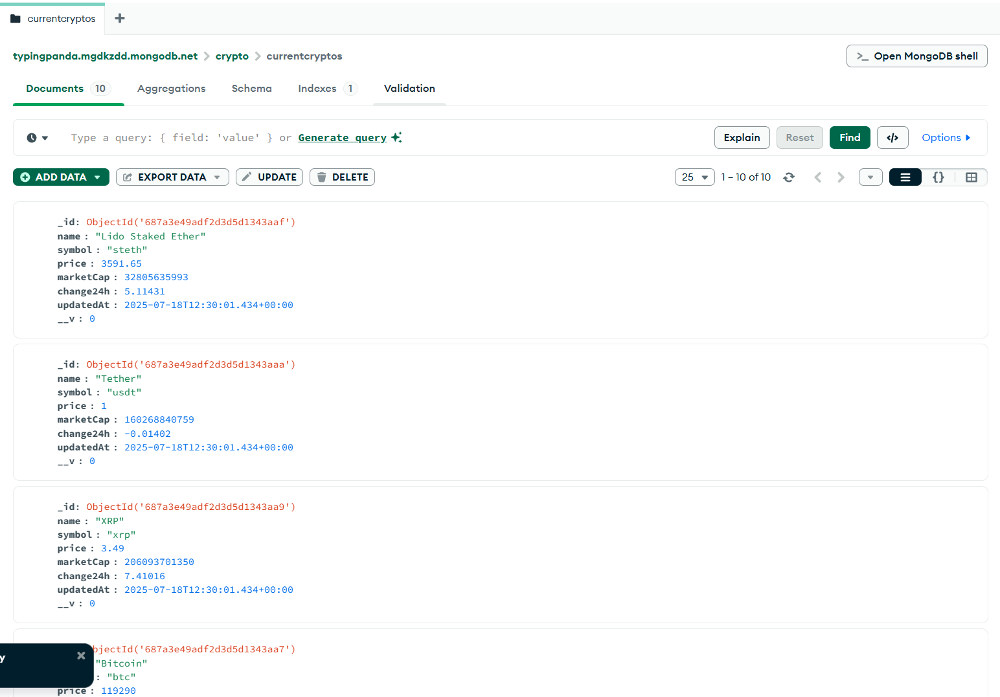
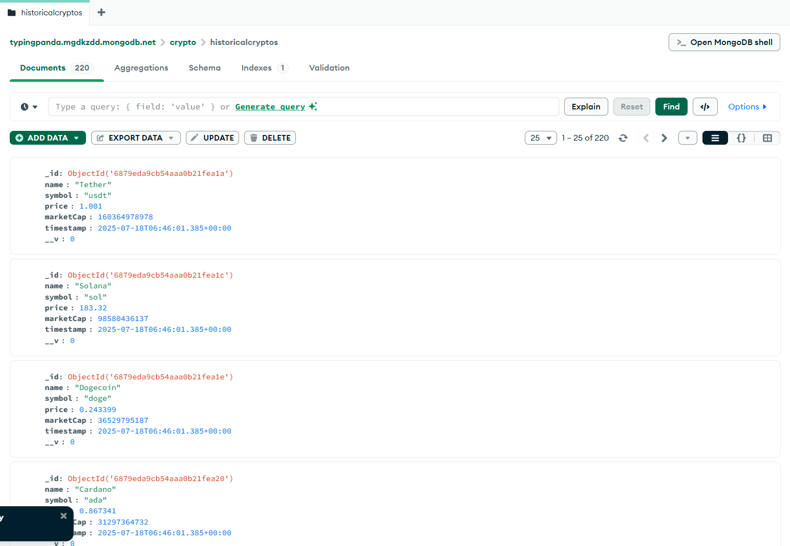
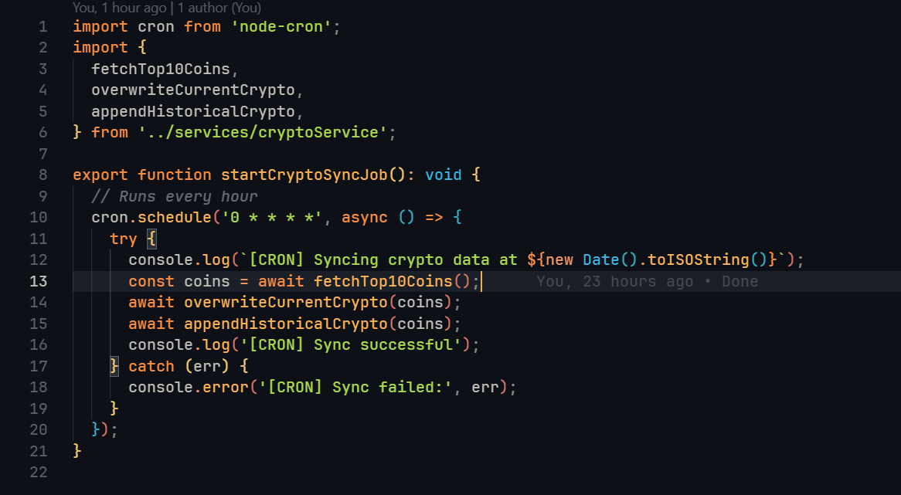

# Crypto Tracker - Final Deliverables

## 🚀 Live URLs

- **Frontend:** [http://ec2-3-6-142-124.ap-south-1.compute.amazonaws.com/](http://ec2-3-6-142-124.ap-south-1.compute.amazonaws.com/)
- **Backend API:** [http://ec2-3-6-142-124.ap-south-1.compute.amazonaws.com/api/](http://ec2-3-6-142-124.ap-south-1.compute.amazonaws.com/api/)

---

## 📦 Repository Structure

```
crypto-assignment/
  ├── crypto-tracker-frontend/   # Frontend (React, Vite, TypeScript)
  ├── crypto-tracker-backend/    # Backend (Node.js, Express, MongoDB)
  └── README.md                  # Root README (this file)
```

---

## 🧱 Tech Stack Used

- **Frontend:** React, Vite, TypeScript, Redux Toolkit, React Query, Tailwind CSS, ShadCN UI, Chart.js
- **Backend:** Node.js, Express, TypeScript, MongoDB (Mongoose), Axios, node-cron
- **Deployment:** AWS EC2, PM2, Nginx

---

## ⚙️ Setup & Installation

### 1. Clone the Repository

```bash
git clone https://github.com/sachu0dev/crypto-assignment.git
cd crypto-assignment
```

### 2. Backend Setup

```bash
cd crypto-tracker-backend
npm install
# Set up your .env (Include: MONGODB_URI="Your URL")
npm run build
npm start
```

### 3. Frontend Setup

```bash
cd crypto-tracker-frontend
npm install
# Set up your .env (Include: VITE_API_URL="Your URL")
npm run build
npm run preview
```

### 4. Deployment

- Both frontend and backend are deployed on AWS EC2 using PM2 and served via Nginx reverse proxy.
- Update your Nginx config to proxy `/api/` to the backend and serve the frontend as static files.

---

## ⏱ How the Cron Job Works

- The backend uses `node-cron` to schedule a job every hour.
- This job fetches the latest top 10 cryptocurrencies from CoinGecko and:
  - Overwrites the current data collection
  - Appends a snapshot to the historical data collection
- The cron job runs automatically in the background as long as the backend server is running.

---

## 📸 Screenshots

### Database with Sample Data




### Cron Job Setup



---

## 🔗 Links

- **Frontend:** [http://ec2-3-6-142-124.ap-south-1.compute.amazonaws.com/](http://ec2-3-6-142-124.ap-south-1.compute.amazonaws.com/)
- **Backend API:** [http://ec2-3-6-142-124.ap-south-1.compute.amazonaws.com/api/](http://ec2-3-6-142-124.ap-south-1.compute.amazonaws.com/api/)

---

## 📂 Folder Structure

```
crypto-assignment/
  ├── crypto-tracker-frontend/
  ├── crypto-tracker-backend/
  └── README.md
```
